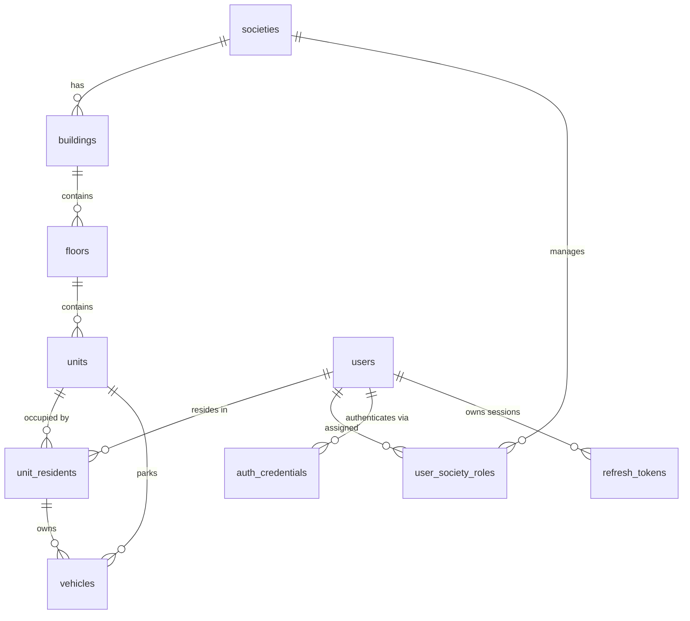

```mermaid
erDiagram                                                                                                                                                          
      societies ||--o{ buildings : "has"                                                                                                                             
      societies ||--o{ user_society_roles : "manages"                                                                                                                
      buildings ||--o{ floors : "contains"                                                                                                                           
      floors ||--o{ units : "contains"                                                                                                                               
      units ||--o{ unit_residents : "occupied by"                                                                                                                    
      units ||--o{ vehicles : "parks"                                                                                                                                
      users ||--o{ unit_residents : "resides in"                                                                                                                     
      users ||--o{ user_society_roles : "assigned"                                                                                                                   
      users ||--o{ auth_credentials : "authenticates via"                                                                                                            
      users ||--o{ refresh_tokens : "owns sessions"                                                                                                                  
      unit_residents ||--o{ vehicles : "owns"                                                                                                                        
                                                    

```